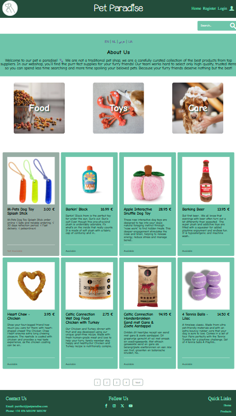
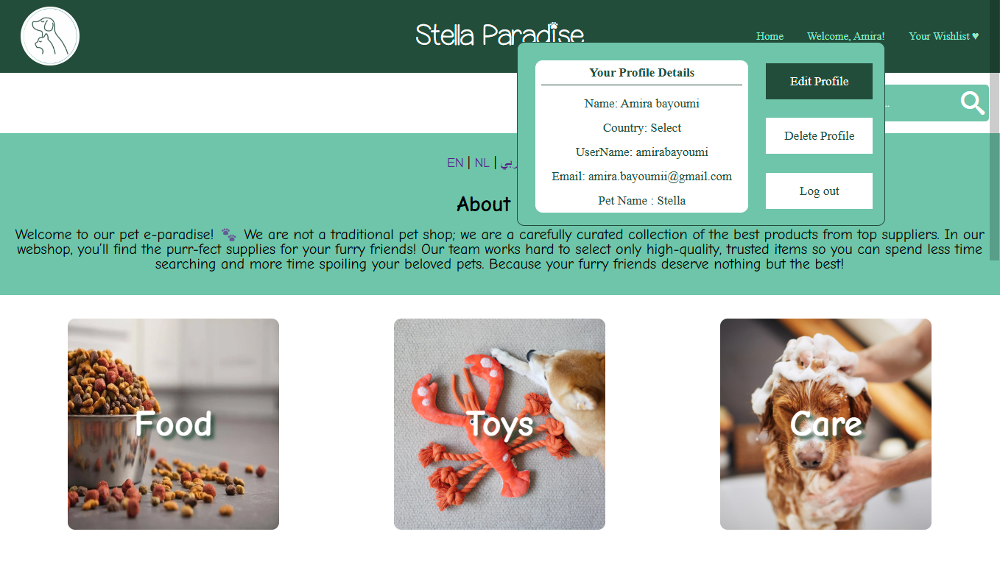
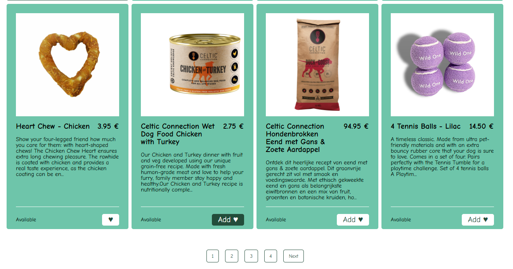
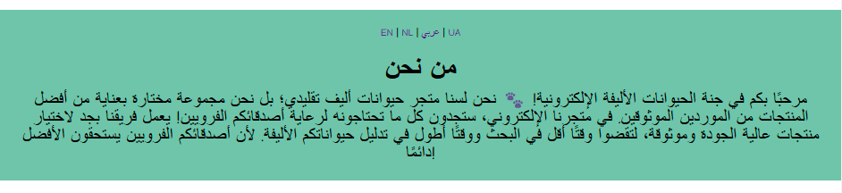
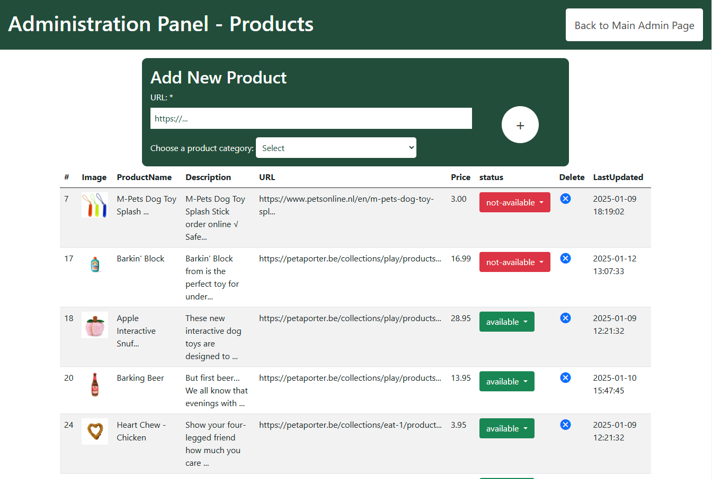

# Pet Paradise

Pet Paradise is a dynamic platform designed to cater to the needs of pet owners. It offers an easy-to-navigate interface for exploring and purchasing a variety of pet products, from toys and food to grooming supplies. The platform provides both a feature-rich shopping experience for users and comprehensive management tools for administrators.

## Key Features

### User-Friendly Design

- **Responsive Webshop**: Browse on any device.
  
- **Smooth Navigation**: Fast and intuitive browsing.
  
- **Search Bar**: Quickly find products by title.
  
___

### Personalized Experience

- Registered users see a **custom interface** with their pet’s name, e.g., "Stella Paradise."
- **Profile management** to update user info or delete account.
  

- **Wishlist** to save/Delete favorite products.
  
___

### Extra Tools

- **Translation**: View "About Us" in 4 languages.
  
- **Pagination**: Load products in smaller batches for a smooth experience.

___
### Admin Tools

- **Manage users** with CRUD functionality.
- Add, update, and delete products with **Open Graph tags** and category options.
- **Update product** availability based on vendor stock.

___

## Technologies Used

- **Backend**:
  - PHP
  - MySQL
  - OpenGraph API

- **Frontend**:
  - HTML
  - Native CSS
  - Bootstrap (admin UI)
  - Vite

## Database Architecture with MySQL (Local)

The database includes structured tables to support:

- **Product**: Stores Open Graph (OG) data.
- **Category**: Links products to categories for easy filtering.
- **User**: Holds user information.
- **Wishlist**: Stores user-selected products.
- **Admin**: Stores admin names and secure access keys for admin zone.

___
# FASE 1: CLIENT SIDE

    $ npm run dev | npm start
    $ npm run build
    $ npm run preview

# FASE 2: SERVER SIDE WITH PHP

    $ npm run build:php => exports css and js for php files in watch-mode
    $ npm run preview:php => to use php built-in webserver. (XAMPP or MAMP can also be used...)

> Do not use /public folder for static assets when using build:php. Because Vite does not scan your html in the php file. It only exports and bundles js and css.
> So just use a /images folder.