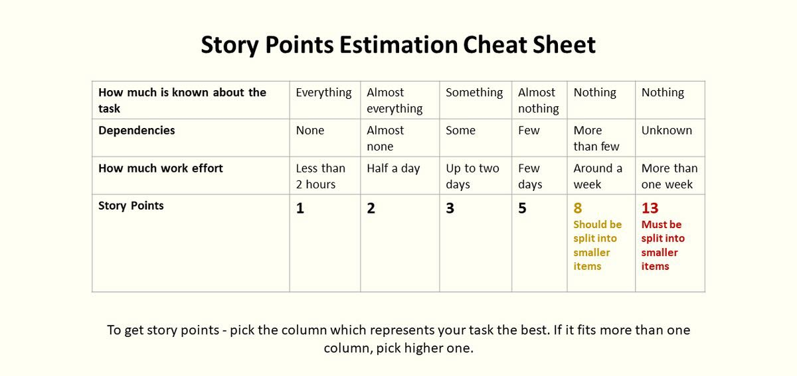

To ensure consistent task management and effective tracking of our project, we will follow the guidelines below when creating and managing tasks in Trello.

#### 1. Task Title
The title must be short and descriptive

Use keywords to clarify the task’s purpose (e.g., "Add credentials for SQL DB connection”)

#### 2. Task Description
Clearly define what needs to be done.

Include links to relevant GitHub files or repositories.

Mention dependencies on other tasks, if any.

#### 3. Labels
Use color-coded labels to categorize tasks:

🟩 Back-end

🟦 Front-end

🟨 UI/UX

🟥 Bug

🟪 Documentation

#### 4. Assignees
Always assign at least one team member to the task.

#### 6. Story Points
Use story points to estimate the complexity and effort required for each task.

Assign points based on the Fibonacci sequence (1, 2, 3, 5, 8, etc.) or another agreed-upon scale.

Example:

1: Very simple task.

2-3: Moderately complex task.

5-8: High complexity or time-consuming task.

#### 7. Sprint Structure
We will organize tasks into three sprints:

Sprint 1 (Dates: 23-29.12.2024): Foundation and core features.

Sprint 2 (Dates: 30-5.01.2025): Advanced features and testing.

Sprint 3 (Dates: 6-12.01.2025): Final polish and deployment preparation.
Tasks should include the Sprint X in their title to clarify which sprint they belong to.

#### 9. GitHub Integration
Add relevant GitHub links (e.g., branches, Pull Requests, Issues) to the task.

#### 10. Deadlines
Clearly set deadlines to align with the sprint schedule.

#### 11. Comments and Collaboration
Use the comments section for discussions or clarifications related to the task.

##### Additional Notes:

Adjustments to the sprint plan can be discussed during sprint reviews or team meetings.