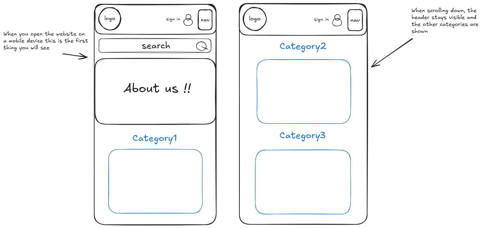

# Pet Paradise - Initial Design Concept

**Overview:**  
Pet Paradise offers a clean, modern, and user-friendly experience for pet owners on both desktop and mobile. The platform focuses on simplicity, quick access, and personalized shopping.

---

### **Key Features:**

- **Responsive Design**: Optimized for both desktop and mobile devices.
- **Search Bar**: Prominent and easy to access for quick product searches.
- **Clear Navigation**: Well-organized categories for effortless browsing.
- **Clean, Modern, and Minimalist Layout**: Focus on highlighting key products and categories.
- **Sign In Feature**: Users can log in to save preferences, view wishlist.
- **Contact Us in Footer**: Clear "Contact Us" section in the footer for easy customer support access.

---

## Design overview
Below is the initial idea sketch for better visualization:

